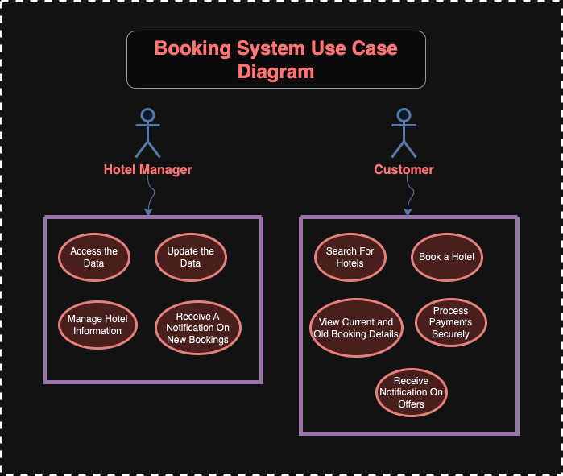

# Requirement Analysis in Software Development  

## Introduction  

This repository is dedicated to understanding and documenting the process of requirement analysis in software development.  
Requirement analysis is a critical phase in the software development lifecycle (SDLC), where the project team gathers, analyzes, and defines the requirements of the software product to be developed. This process ensures that all stakeholders have a clear and mutual understanding of what the system should do and how it should perform.  

The purpose of this repository is to examine various methods of requirement analysis to ensure the final product achieves its desired outcomes.  

## What is Requirement Analysis?  

Requirement Analysis is the systematic process of identifying, documenting, and managing the needs and requirements of a software product.  
It plays a foundational role in the software development lifecycle (SDLC), helping developers and stakeholders align their expectations with the intended functionality of the system.  

### Importance in SDLC:  
- Ensures clear communication between stakeholders and the development team.  
- Reduces the likelihood of misunderstandings and costly errors.  
- Establishes a roadmap for development, testing, and deployment.  

## Why is Requirement Analysis Important?  

1. **Clarity and Understanding:**  
   Helps in understanding what the stakeholders expect from the software, reducing ambiguity.  

2. **Scope Definition:**  
   Clearly defines the scope of the project, which helps in preventing scope creep.  

3. **Basis for Design and Development:**  
   Provides a solid foundation for designing and developing the system.  

4. **Time and Cost Estimation:**  
   Facilitates accurate estimation of the project cost, resources, and time.  

5. **Quality Assurance:**  
   Ensures that the final product meets the specified requirements, leading to higher customer satisfaction.  

## Key Activities in Requirement Analysis  

### Requirement Gathering  
- Engage with stakeholders to collect initial requirements.  
- Use techniques such as:  
  - Interviews  
  - Surveys/Questionnaires  
  - Workshops  
  - Observation  
  - Document analysis  

### Requirement Elicitation  
- Refine and elaborate on the gathered requirements.  
- Extract detailed requirements through techniques like:  
  - Brainstorming  
  - Focus groups  
  - Prototyping  

### Requirement Documentation  
- Document requirements in a detailed and structured format.  
- Define:  
  - Functional requirements  
  - Non-functional requirements  
- Write user stories.  
- Create visual representations like use case diagrams.  

### Requirement Analysis and Modeling  
- Analyze and prioritize the requirements.  
- Prioritize requirements based on their importance and impact on the project goals.  
- Assess the feasibility of requirements in terms of:  
  - Technical constraints  
  - Financial constraints  
  - Time constraints  
- Create models to visualize and analyze requirements, such as:  
  - Data flow diagrams  
  - Entity-relationship diagrams  

### Requirement Validation  
- Review and validate requirements with stakeholders.  
- Verify that documented requirements meet stakeholder expectations and project objectives.  
- Define clear acceptance criteria for each requirement to ensure they meet expected standards.  
- Establish traceability matrices to ensure all requirements are addressed during development and testing.  

## Types of Requirements  

In the context of the hotel booking application system design, it is essential to differentiate between **Functional Requirements** and **Non-functional Requirements** using this case study: [Case Study: Hotel Booking Application System Design](https://medium.com/nerd-for-tech/system-design-architecture-for-hotel-booking-apps-like-airbnb-oyo-6efb4f4dddd7)
. This distinction helps ensure clarity in the system's capabilities and its operational qualities.  

---

### 1. Functional Requirements  

**Definition:**  
Describe what the system should do.  

**Examples for the Hotel Booking System:**  

1. **Hotel Management Service:**  
   - Managers should be able to access the data, update it, and manage hotel-related information.  
   - The system must sync updated hotel information from the master database to slave databases for efficient read operations.  

2. **Customer Service (Search + Booking):**  
   - Customers must be able to search for hotels.  
   - The system should allow customers to book a hotel.  
   - Integrate with third-party payment services to process payments securely.  

3. **View Booking Service:**  
   - Users (customers and managers) should be able to view current and old booking details.  

4. **Final Design:**  
   - Notifications must be sent to managers when a new booking is made and to customers for updates like offers.  

---

### 2. Non-functional Requirements  

**Definition:**  
Describe how the system should perform.  

**Examples for the Hotel Booking System:**  

1. **Performance and Scalability:**  
   - A Content Delivery Network (CDN) must ensure low-latency delivery of hotel data globally, supporting a growing user base without compromising speed.  

2. **Reliability and Availability:**  
   - The system must guarantee high availability, ensuring services remain accessible to customers and managers with minimal downtime.  
   - Periodic data backups should be performed using scalable storage solutions like Cassandra to prevent data loss and support disaster recovery.  

3. **Efficiency:**  
   - A caching mechanism (e.g., Redis) should minimize response times for frequently accessed data, enhancing user experience.  
   - ElasticSearch must efficiently handle complex and large-scale hotel searches, providing fast and accurate results.  

---

## Use Case Diagrams  

Use Case Diagrams visually represent the interactions between users (actors) and the system.  

### **Benefits:**  
- Provide a clear visual representation of system functionalities.  
- Help in identifying and organizing system requirements.  
- Facilitate communication among stakeholders and development team.  

### Example: Booking System Use Case Diagram  
  

## Acceptance Criteria  

Acceptance criteria are conditions that a feature must meet to be accepted by the stakeholders.  

### **Importance:**  
- Ensures that development aligns with user expectations.  
- Acts as a benchmark for testing and validation.  
- Helps in maintaining quality.  

### **Example for Checkout Feature:**  
- Users must be able to add their payment details securely.  
- The system must confirm the booking with a message and email.  
- The user should be redirected to a confirmation page upon successful payment.  
